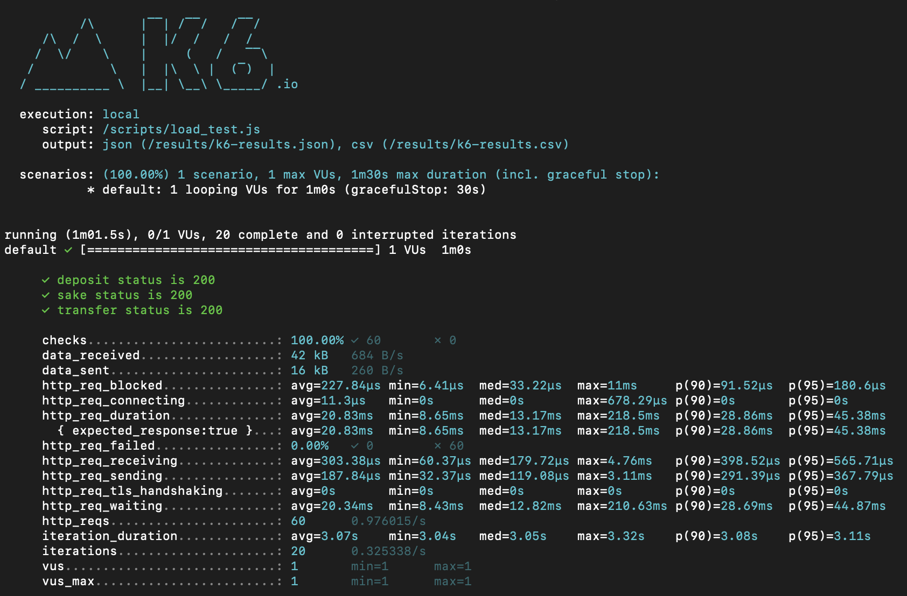

# Introduction

Implementação de teste para projeto Finance

# Requirements

- Utilizar o Docker e Docker Compose
- Banco de dados MariaDB
- PHP 8.3
- Framework HyperF 3.1

## Iniciar projeto

Para facilitar a inicialização do projeto foi criado um arquivo na raiz do projeto chamado run.

- Dar permissão de execução do arquivo.
```bash
chomod +x run 
```

Iniciar o docker compose.
```bash
./run install
```

Acessar o banco de dados
[http://localhost:8080](http://localhost:8080)

Teste de transações com DEPOSIT
```curl
curl --request POST \
  --url http://localhost:9501/transaction \
  --header 'Content-Type: application/json' \
  --header 'User-Agent: insomnia/10.1.1' \
  --data '{
	"account_number" : "68c2c56d-8310-4628-b886-a82fccc289f5",
	"transaction_type" : "DEPOSIT",
	"transaction_value" : 100
}'
```

Teste de transações com SAKE
```curl
curl --request POST \
  --url http://localhost:9501/transaction \
  --header 'Content-Type: application/json' \
  --header 'User-Agent: insomnia/10.1.1' \
  --data '{
	"account_number" : "68c2c56d-8310-4628-b886-a82fccc289f5",
	"transaction_type" : "SAKE",
	"transaction_value" : 100
}'
```

Teste de transações com TRANSFER
```curl
curl --request POST \
  --url http://localhost:9501/transfer \
  --header 'Content-Type: application/json' \
  --header 'User-Agent: insomnia/10.1.1' \
  --data '{
	"account_number_origin" : "7557f6da-61f7-4e9c-8479-88aa52ed2050",
	"account_number_destination" : "68c2c56d-8310-4628-b886-a82fccc289f5",
	"transaction_value" : 100
}'
```

Rodando test.
```bash
./run test
```

Rodando test cobertura.
```bash
./run coverage
```

Rodando test K6.
```bash
./run testK6
```




## Recuperação de falhas

Implementar o uso de um semaphore (ou semáforo) seria uma abordagem eficaz para controlar o acesso concorrente a recursos compartilhados no sistema de gestão de conta-corrente, particularmente para garantir a integridade dos dados durante transações simultâneas.

Explicação do semaphore
Um semáforo é um mecanismo de sincronização que permite limitar o número de acessos simultâneos a um recurso. Neste caso, ele poderia controlar quantas operações de transação podem ocorrer em uma conta ao mesmo tempo. O semáforo impede que múltiplas transações concorrentes causem inconsistências ao definir um limite (geralmente 1) para evitar que mais de uma operação seja aplicada ao saldo da conta ao mesmo tempo.

Prós e Contras
Prós:

Integridade dos Dados: Um semáforo garante que apenas uma transação seja processada de cada vez por conta, evitando problema de concorrência e mantendo a consistência dos dados.
Controle de Conflitos: Ele permite que o sistema gerencie conflitos de acesso, evitando que operações concorrentes se sobreponham e causem erros.
Simplicidade: É um mecanismo mais simples de implementar do que outras alternativas de sincronização complexa, como transações distribuídas.
Contras:

Desempenho: Pode reduzir o desempenho ao limitar o número de transações que podem ocorrer ao mesmo tempo, causando atrasos se houver muitas requisições simultâneas.
Complexidade de Gerenciamento: Configurar semáforos para evitar deadlocks ou sobrecargas requer um planejamento cuidadoso, especialmente em um sistema distribuído.
Latência em Escalabilidade: Quando a quantidade de transações cresce muito, o sistema pode enfrentar gargalos, dificultando o escalonamento para lidar com alta demanda.
O uso de semáforos é, portanto, uma escolha válida para garantir a integridade e a confiabilidade do sistema em transações simultâneas, mas deve ser equilibrado com as demandas de desempenho e escalabilidade.
